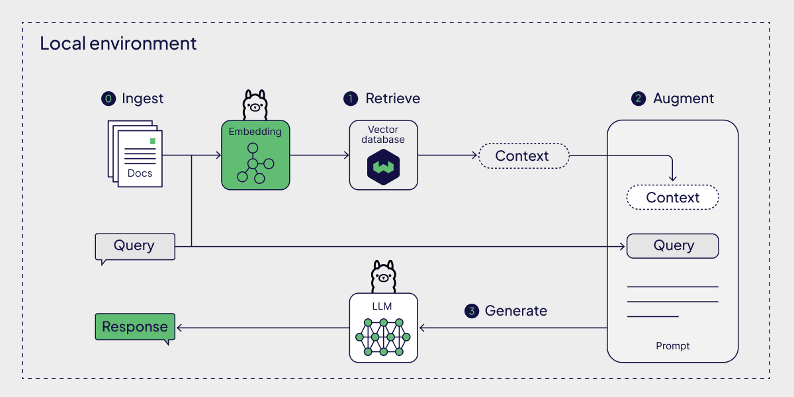

# 🥗 HUMAN NUTRITION RAG CHATBOT

<p align="center">
  
</p>

**Human Nutrition RAG Chatbot** is a full-stack **Retrieval-Augmented Generation (RAG)** system designed to answer nutrition-related questions using **human nutrition textbooks** as the sole source of truth.

Unlike generic chatbots, this system **grounds every response in retrieved textbook content**, significantly reducing hallucinations and improving factual reliability. The LLM runs **locally via Ollama**, ensuring privacy, offline capability, and full control over inference.

---

## ✨ Key Features

- 📚 **Retrieval-Augmented Generation (RAG)**  
  Retrieves relevant textbook chunks before generating answers.
- 🧠 **Local LLM Inference**  
  Uses **Gemma via Ollama**, running entirely on the local machine.
- 🔒 **Privacy-First Architecture**  
  No external LLM APIs required during inference.
- 📊 **Vector Search with Supabase**  
  Stores and queries embeddings using cosine similarity.
- 🔍 **Source-Aware Responses**  
  Each answer includes **references to the retrieved document chunks**.
- 📈 **Monitoring & Observability**
  Integrated with **Prometheus** and **Grafana** for API health and performance metrics.

---

## 🛠️ Tech Stack

### Frontend
* **UI/UX:** Vanilla JavaScript, HTML5, CSS3
* **Icons:** Lucide
* **Markdown Rendering:** `marked.js`

### Backend & AI
* **Framework:** FastAPI (Python)
* **LLM Runtime:** Ollama (Local)
* **Model:** Gemma Series (`gemma3:1b`)
* **Embedding Model:** `jeffh/intfloat-e5-base-v2`
* **Vector Database:** Supabase (pgvector)

### Ops & Observability
* **Deployment:** Docker & Docker Compose
* **Monitoring:** Prometheus & Grafana

---

## 📂 Project Structure

```text
rag-chat/
├── backend/                  # FastAPI backend server
│   ├── app/                  # Application core logic & services
│   ├── main.py               # Application entry point
│   └── ingest.py             # Script for vectorizing PDFs to Supabase
├── frontend/                 # Static frontend assets (HTML, JS, CSS)
├── ops/                      # Docker configuration and monitoring (Prometheus/Grafana)
├── .env                      # Environment variables (ignored)
├── requirements.txt          # Python dependencies
├── start.ps1                 # Launch script for Windows
└── README.md                 # Project documentation
```

---

## 🚀 Getting Started

### ✅ Prerequisites

* **Node.js** (v18+) - Optional for tooling
* **Python** (v3.10+)
* **Docker** & **Docker Compose**
* **Ollama** → [https://ollama.com](https://ollama.com)
* **Supabase** project with `pgvector` enabled

### 1️⃣ Setup Environment

Create a `.env` file in the root directory:

```env
SUPABASE_URL=your_supabase_url
SUPABASE_SERVICE_ROLE_KEY=your_supabase_service_role_key
OLLAMA_URL=http://localhost:11434
OLLAMA_MODEL=gemma3:1b
OLLAMA_EMBED_MODEL=jeffh/intfloat-e5-base-v2:f32
```

### 2️⃣ Start Local LLM (Ollama)

```bash
ollama pull gemma3:1b
ollama serve
```

### 3️⃣ Launch the Application

For a quick launch on Windows, you can use the startup script:

```powershell
.\start.ps1
```

If Docker is running, it will automatically launch the **Full Stack (Ops Mode)** including Grafana and Prometheus.
Otherwise, it will start the **Local Mode** FastAPI server.

Alternatively, you can run the backend manually:

```bash
cd backend
python -m venv venv
# Windows: venv\Scripts\activate
# Unix: source venv/bin/activate
pip install -r requirements.txt
uvicorn main:app --reload
```

The app will be available at `http://localhost:8000`.

### 4️⃣ Ingest Data (Optional)

If you need to upload new textbook documents to Supabase:
```bash
cd backend
python ingest.py
```

---

## 📜 License

This project is intended for **educational and research purposes only**.
