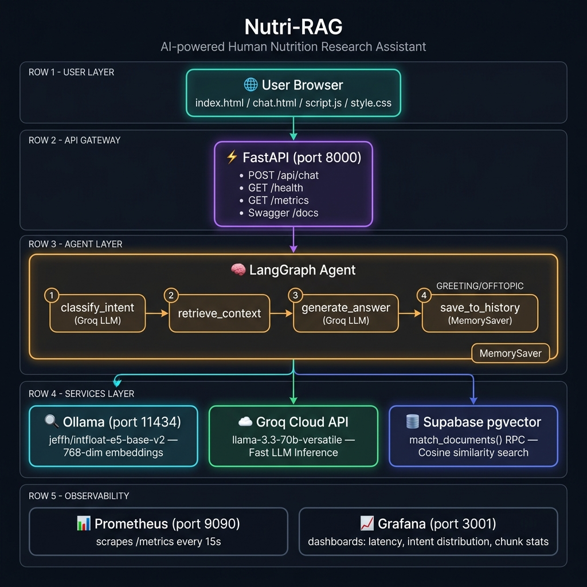

# 🥗 Nutri-RAG — AI Human Nutrition Research Assistant

<p align="center">
  
</p>

<p align="center">
  <a href="https://github.com/features/actions"></a>
  
  
  
  
  
</p>

> **Nutri-RAG** answers human nutrition questions grounded in peer-reviewed textbooks — using a LangGraph RAG agent, Supabase pgvector, Groq cloud LLM, and Ollama local embeddings. Every response includes **verified source citations** and a **context-proof payload** so you always know where the answer came from.

---

## 📐 Architecture

```
┌─────────────────────────────────────────────────────────────────────┐
│                         USER BROWSER                                │
│          index.html  │  chat.html  │  script.js  │  style.css       │
└──────────────────────────────┬──────────────────────────────────────┘
                               │  POST /api/chat
                               ▼
┌─────────────────────────────────────────────────────────────────────┐
│                    FastAPI  (port 8000)                              │
│   POST /api/chat │ GET /health │ GET /metrics │ GET /docs            │
│        ↓ CORS middleware + Prometheus instrumentation                │
└──────────────────────────────┬──────────────────────────────────────┘
                               │
                               ▼
┌─────────────────────────────────────────────────────────────────────┐
│                    LangGraph Agent  (StateGraph)                     │
│                                                                      │
│   ┌─────────────────────────────────────────────────────────────┐   │
│   │  1. classify_intent ──(NUTRITION)──▶ 2. retrieve_context    │   │
│   │         (Groq LLM)                        │                  │   │
│   │              │                            ▼                  │   │
│   │    (GREETING/OFFTOPIC)           3. generate_answer          │   │
│   │              │                     (Groq LLM)                │   │
│   │              ▼                            │                  │   │
│   │   3b. generate_direct_response            │                  │   │
│   │         (Groq LLM)                        │                  │   │
│   │              └──────────────┬─────────────┘                  │   │
│   │                             ▼                                │   │
│   │                  4. save_to_history (MemorySaver)            │   │
│   └─────────────────────────────────────────────────────────────┘   │
└────────┬──────────────────────────────────────┬─────────────────────┘
         │                                      │
         ▼                                      ▼
┌─────────────────┐                  ┌──────────────────────────┐
│  Ollama (11434)  │                  │   Supabase pgvector       │
│  E5-base-v2     │                  │   match_documents() RPC   │
│  768-dim embed  │                  │   Cosine similarity       │
└─────────────────┘                  └──────────────────────────┘
                    ┌─────────────────┐
                    │   Groq Cloud     │
                    │ llama-3.3-70b   │
                    └─────────────────┘

── OBSERVABILITY ──────────────────────────────────────────────────────
  Prometheus (9090)  ←─ scrapes /metrics ──  nutri-rag:8000
  Grafana    (3001)  ←─ reads Prometheus ──  auto-provisioned dashboard
```

---

## 🛠️ Tech Stack

| Layer | Technology |
|---|---|
| API Framework | **FastAPI** 0.115 + **uvicorn** |
| Agent Orchestration | **LangGraph** 0.2 (StateGraph + MemorySaver) |
| LLM | **Groq** — `llama-3.3-70b-versatile` |
| Embeddings | **Ollama** — `jeffh/intfloat-e5-base-v2:f16` (768-dim) |
| Vector Database | **Supabase** PostgreSQL + `pgvector` |
| Observability | **Prometheus** + **Grafana** |
| Containerisation | **Docker** + **Docker Compose** |
| Serverless | **Vercel** (Python runtime) |
| Frontend | Vanilla HTML/CSS/JS — no build step |

---

## 🚀 Complete Running Guide

### Prerequisites — Install These First

| Tool | Version | Install |
|---|---|---|
| Python | 3.11+ | https://python.org |
| Ollama | Latest | https://ollama.com |
| Git | Any | https://git-scm.com |
| Docker Desktop | Latest | https://docker.com *(optional — for monitoring stack)* |

---

### Step 1 — Clone & Configure Environment

```bash
git clone https://github.com/your-org/rag-chat.git
cd rag-chat

# Copy the environment template
copy .env.example .env      # Windows
# cp .env.example .env      # macOS / Linux
```

Open `.env` and fill in **all four** required values:

```env
# ── Required ─────────────────────────────────────────
SUPABASE_URL=https://your-project-id.supabase.co
SUPABASE_SERVICE_ROLE_KEY=eyJhbGc...   # Settings → API → service_role key

GROQ_API_KEY=gsk_...                   # https://console.groq.com/keys

# ── Optional (defaults shown) ─────────────────────────
OLLAMA_URL=http://localhost:11434
OLLAMA_EMBED_MODEL=jeffh/intfloat-e5-base-v2:f16
EMBEDDING_MODEL=jeffh/intfloat-e5-base-v2:f16
LOG_LEVEL=INFO
ALLOWED_ORIGINS=*                      # Lock down in production
```

---

### Step 2 — Set Up Supabase (One-Time)

In your Supabase project → **SQL Editor**, run this SQL:

```sql
-- 1. Enable pgvector
CREATE EXTENSION IF NOT EXISTS vector;

-- 2. Create the chunks table
CREATE TABLE IF NOT EXISTS public.chunks (
    id          bigserial   PRIMARY KEY,
    doc_id      text        NOT NULL,
    chunk_index integer     NOT NULL DEFAULT 0,
    content     text        NOT NULL,
    metadata    jsonb       DEFAULT '{}'::jsonb,
    embedding   vector(768),
    created_at  timestamptz DEFAULT now()
);

-- 3. Create IVFFlat index for fast vector search
CREATE INDEX IF NOT EXISTS chunks_embedding_idx
    ON public.chunks
    USING ivfflat (embedding vector_cosine_ops)
    WITH (lists = 100);

-- 4. Create the search function used by the API
CREATE OR REPLACE FUNCTION public.match_documents(
    query_embedding vector(768),
    match_count     integer DEFAULT 5
)
RETURNS TABLE (
    doc_id      text,
    chunk_index integer,
    content     text,
    metadata    jsonb,
    similarity  float
)
LANGUAGE plpgsql STABLE AS $$
BEGIN
    RETURN QUERY
    SELECT c.doc_id, c.chunk_index, c.content, c.metadata,
           (1 - (c.embedding <=> query_embedding))::float AS similarity
    FROM public.chunks c
    WHERE c.embedding IS NOT NULL
    ORDER BY c.embedding <=> query_embedding
    LIMIT match_count;
END;
$$;
```

See [SETUP.md](SETUP.md) for full details on RLS and indexing.

---

### Step 3 — Pull Ollama Embedding Model

```bash
# Start Ollama (runs in background)
ollama serve

# In a new terminal — pull the embedding model (~900 MB)
ollama pull jeffh/intfloat-e5-base-v2

# Verify it loaded
ollama list
```

> ⚠️ **First embedding request takes 20–60 seconds** (model cold-start). This is normal. Subsequent requests are fast.

---

### Step 4 — Ingest Nutrition Textbooks (One-Time)

```bash
cd backend

# Create and activate virtual environment
python -m venv venv
.\venv\Scripts\activate           # Windows
# source venv/bin/activate        # macOS / Linux

# Install dependencies
pip install -r requirements.txt

# Ingest a PDF (replace with your actual file path)
python ingest.py path/to/nutrition_textbook.pdf

# Dry-run first to validate without writing to Supabase
python ingest.py path/to/nutrition_textbook.pdf --dry-run
```

The ingest script:
1. Opens the PDF with PyMuPDF
2. Splits each page into 1000-character chunks
3. Prefixes each chunk with `"passage: "` (required by E5 model)
4. Generates a 768-dim embedding via Ollama
5. Inserts `{doc_id, chunk_index, content, metadata, embedding}` into Supabase

---

### Step 5A — Run Locally (Development)

```bash
# Make sure you are in backend/ with venv activated
cd backend
.\venv\Scripts\activate

# Start the API with auto-reload
uvicorn main:app --reload --port 8000
```

| URL | What you get |
|---|---|
| http://localhost:8000 | Landing page |
| http://localhost:8000/chat | Chat UI |
| http://localhost:8000/docs | Swagger UI (interactive API docs) |
| http://localhost:8000/health | Health check JSON |
| http://localhost:8000/metrics | Prometheus metrics |

---

### Step 5B — Run with Docker + Full Monitoring Stack

This starts **the API + Prometheus + Grafana** all at once.

```bash
cd ops
docker-compose up --build -d

# Watch logs
docker-compose logs -f nutri-rag

# Stop everything
docker-compose down
```

| Service | URL | Credentials |
|---|---|---|
| Nutri-RAG API | http://localhost:8000 | — |
| Prometheus | http://localhost:9090 | — |
| Grafana | http://localhost:3001 | `admin / admin` |

---

## 📊 Monitoring Guide

### Prometheus — Metrics Scraping

Prometheus automatically scrapes `http://nutri-rag:8000/metrics` every 15 seconds (configured in `ops/prometheus.yml`).

**Check scrape status:**
1. Open http://localhost:9090
2. Go to **Status → Targets**
3. Confirm `nutri-rag` shows **UP** in green

**Explore raw metrics in Prometheus:**
- http://localhost:9090/graph
- Try these queries:

```promql
# Total chat requests
nutri_rag_chat_requests_total

# Requests grouped by intent label (NUTRITION / GREETING / OFFTOPIC)
nutri_rag_chat_intent_total

# Average answer latency (seconds)
rate(nutri_rag_chat_answer_latency_seconds_sum[5m])
/ rate(nutri_rag_chat_answer_latency_seconds_count[5m])

# P95 latency
histogram_quantile(0.95, rate(nutri_rag_chat_answer_latency_seconds_bucket[5m]))

# Average retrieved chunks per request
rate(nutri_rag_chat_retrieved_chunks_sum[5m])
/ rate(nutri_rag_chat_retrieved_chunks_count[5m])
```

---

### Grafana — Pre-Built Dashboard

The `ops/grafana-rag-dashboard.json` dashboard is **auto-provisioned** — it loads automatically when Grafana starts via the provisioning config in `ops/grafana/provisioning/`.

**Access Grafana:**
1. Open http://localhost:3001
2. Login: `admin` / `admin`
3. Go to **Dashboards → RAG Chat**

**What the dashboard shows:**

| Panel | Metric | Why it matters |
|---|---|---|
| Total Requests | `nutri_rag_chat_requests_total` | Overall usage volume |
| Intent Distribution | `nutri_rag_chat_intent_total` | Is the chatbot being used for nutrition or going off-topic? |
| Answer Latency P50/P95 | `nutri_rag_chat_answer_latency_seconds` | End-to-end response time |
| Retrieved Chunks | `nutri_rag_chat_retrieved_chunks` | Retrieval pipeline health |
| Top Similarity Score | `nutri_rag_chat_top_similarity` | Are answers grounded in relevant documents? |
| HTTP Error Rate | `http_requests_total{status=~"5.."}` | API stability |

**Latency targets to aim for:**
- P50 < 3 seconds ✅
- P95 < 8 seconds ✅
- P99 > 15 seconds → investigate Ollama cold-start or Groq API lag

---

## 📡 API Reference

### `GET /health`

```json
{ "status": "ok", "service": "Nutri-RAG Modular" }
```

### `POST /api/chat`

**Request:**
```json
{
  "message": "What are the functions of Vitamin D?",
  "session_id": "your-session-uuid"
}
```

**Response:**
```json
{
  "answer": "### Vitamin D Functions\n\n**Vitamin D** is essential for...",
  "intent": "NUTRITION",
  "sources": [
    {
      "doc_id": "nutrition_textbook.pdf",
      "chunk_index": 12,
      "content": "Vitamin D is essential for calcium absorption...",
      "similarity": 0.923,
      "metadata": { "page_number": 47 }
    }
  ],
  "proof_of_context": {
    "grounded": true,
    "reason": "Answer generated from retrieved research chunks.",
    "retrieved_chunks": 5,
    "top_similarity": 0.923,
    "citations": [
      { "citation": "[1]", "doc_id": "nutrition_textbook.pdf", "similarity": 0.923, "excerpt": "Vitamin D is essential for..." }
    ]
  }
}
```

**Intent values:**
- `NUTRITION` — Answer was RAG-grounded using retrieved textbook chunks
- `GREETING` — Conversational response, no retrieval needed
- `OFFTOPIC` — Question outside nutrition scope

---

## 🧪 Running Tests

No Supabase, Ollama, or Groq needed — tests use mock env vars.

```bash
cd backend
.\venv\Scripts\activate

# Run all unit tests
pytest tests/ -v

# With coverage report
pytest tests/ -v --cov=app --cov-report=term-missing
```

---

## 🗂️ Project Structure

```
rag-chat/
├── .env                          ← Your secrets (never commit)
├── .env.example                  ← Template — safe to commit
├── README.md
├── SETUP.md                      ← Supabase SQL setup guide
├── CHALLENGES.md                 ← 12 technical challenges documented
├── start.ps1                     ← Windows 1-click launcher
├── vercel.json                   ← Vercel deployment routing
│
├── api/
│   └── index.py                  ← Vercel serverless entry point
│
├── backend/
│   ├── main.py                   ← Uvicorn entry point
│   ├── ingest.py                 ← PDF ingestion CLI (--dry-run flag)
│   ├── Dockerfile                ← Multi-stage production image
│   ├── requirements.txt          ← Pinned Python dependencies
│   ├── pyproject.toml            ← pytest config
│   ├── app/
│   │   ├── config.py             ← Centralised env config
│   │   ├── factory.py            ← FastAPI app factory
│   │   ├── api/routes/chat.py    ← POST /api/chat  GET /health
│   │   ├── core/
│   │   │   ├── logging_config.py ← Structured JSON logging
│   │   │   └── metrics.py        ← Prometheus counters/histograms
│   │   ├── models/schemas.py     ← Pydantic request/response models
│   │   └── services/
│   │       ├── langgraph_agent.py ← LangGraph RAG agent (core engine)
│   │       ├── proof_service.py  ← Context proof builder
│   │       └── vector_store.py   ← Ollama embed + Supabase search
│   └── tests/
│       ├── conftest.py
│       ├── test_proof_service.py
│       └── test_schemas.py
│
├── frontend/
│   ├── index.html                ← Landing page
│   ├── chat.html                 ← Chat UI
│   ├── script.js                 ← API calls, markdown rendering
│   ├── style.css                 ← Dark/light theme design
│   └── architecture.png          ← System architecture diagram
│
└── ops/
    ├── docker-compose.yml        ← API + Prometheus + Grafana
    ├── prometheus.yml            ← Scrape config
    ├── grafana-rag-dashboard.json ← Pre-built dashboard
    └── grafana/provisioning/     ← Auto-provision datasource
```

---

## ☁️ Vercel Deployment

1. Push repo to GitHub.
2. Connect repo to [Vercel](https://vercel.com).
3. Set environment variables in Vercel dashboard:
   - `SUPABASE_URL`
   - `SUPABASE_SERVICE_ROLE_KEY`
   - `GROQ_API_KEY`
   - `OLLAMA_URL` *(point to a persistent Ollama server)*
4. Deploy — Vercel routes via `vercel.json` automatically.

> ⚠️ Vercel Hobby plan has a **10-second function timeout**. Groq + Supabase together can take 4–8s. For production, use Vercel Pro (60s timeout) or host on Railway / Render / GCP Cloud Run.

---

## 🔥 Common Issues & Fixes

| Symptom | Cause | Fix |
|---|---|---|
| First chat takes 60s | Ollama model cold-start | Wait — subsequent requests are fast |
| `similarity: 0.0` on all results | Missing `"query: "` prefix on embeddings | Already handled in `vector_store.py` |
| `500` on `/api/chat` | Missing env vars | Check `.env` has all 3 required keys |
| Frontend shows 404 | Wrong working directory | Run `uvicorn main:app` from `backend/` not root |
| Grafana shows "No data" | Prometheus not scraping | Check `docker-compose up` and port 9090 |
| `Port 8000 already in use` | Previous uvicorn still running | `Get-Process -Name python \| Stop-Process` |

---

## 📜 License

Educational and research use only. Textbook content must comply with applicable copyright law.
